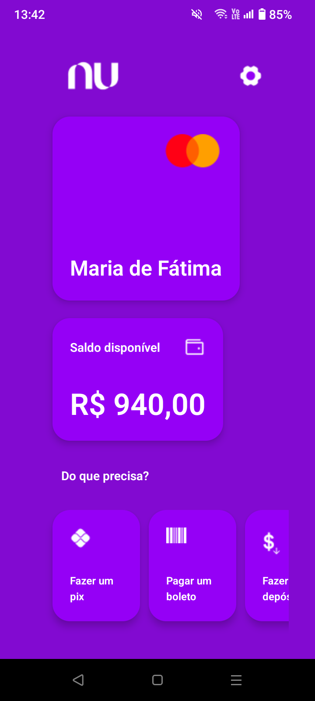
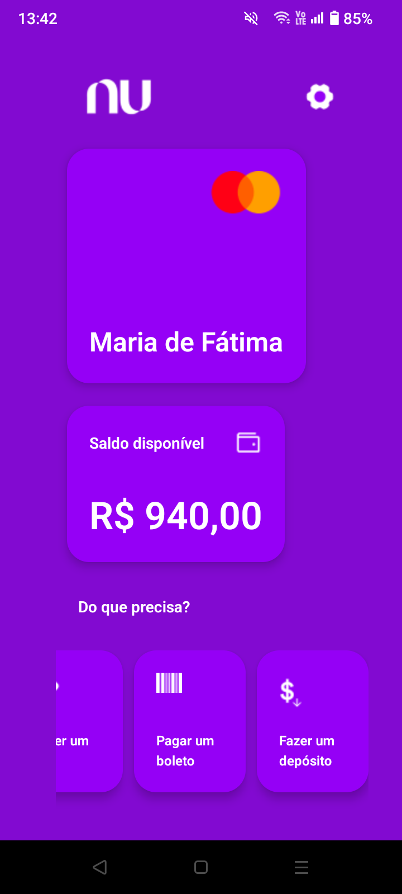

# Nubank UI 📲💜

Bem-vindo ao meu portfólio! Aqui, apresento um projeto desafiador e empolgante que desenvolvi: o clone da tela inicial do aplicativo Nubank usando React Native e Expo. Este projeto demonstra meu aprendizado em desenvolvimento mobile, atenção aos detalhes e capacidade de replicar interfaces de usuário de alta qualidade.

## Visão Geral do Projeto

O objetivo deste projeto foi recriar a tela inicial do aplicativo Nubank, capturando seu design moderno e funcionalidade. A aplicação foi desenvolvida utilizando React Native, uma poderosa biblioteca JavaScript para construção de interfaces móveis, juntamente com Expo, uma plataforma para desenvolvimento rápido de aplicativos nativos.

## Funcionalidades

- **Interface de Usuário Atraente:** Uma réplica fiel da tela inicial do Nubank, com um design limpo e moderno.
- **Componentes Personalizados:** Criação de componentes reutilizáveis para garantir a consistência da interface.
- **Responsividade:** Adaptação perfeita a diferentes tamanhos de tela e dispositivos.
- **Desempenho Otimizado:** Uso eficiente de recursos para garantir uma experiência de usuário fluida.

## Tecnologias Utilizadas

- **React Native:** Biblioteca JavaScript para construção de interfaces móveis.
- **Expo:** Plataforma que facilita o desenvolvimento, a construção e a implantação de aplicativos nativos.
- **JavaScript ES6:** Sintaxe moderna do JavaScript para um código mais claro e conciso.
- **CSS-in-JS:** Estilização de componentes usando técnicas modernas.

## Estrutura do Projeto

A estrutura do projeto foi organizada de forma a garantir escalabilidade e manutenção fácil. A seguir, a estrutura de pastas principal:

```
/
├── assets/         # Imagens e ícones utilizados no projeto
├── src/     # Componentes reutilizáveis da interface
├── screens/        # Telas principais da aplicação
├── App.js          # Arquivo principal da aplicação
├── README.md       # Documentação do projeto
├── package.json    # Dependências e scripts do projeto
```

## Como Executar o Projeto

Para executar o projeto localmente, siga as etapas abaixo:

1. **Clone o repositório:**

```bash
git clone https://github.com/alvesmariadefatima/nubank-ui.git
cd nubank-ui
```

2. **Instale as dependências:**

```bash
npm install
```

3. **Inicie o Expo:**

```bash
npx expo start
```

4. **Execute no dispositivo ou emulador:**

- Escaneie o código QR com o aplicativo Expo Go (disponível na App Store e Google Play) para visualizar no seu dispositivo.
- Utilize um emulador Android ou iOS configurado em seu computador.

## Capturas de Tela

Aqui estão algumas capturas de tela do aplicativo Nubank:


<br><br>


## Contato

Para mais informações sobre este projeto ou para discutir possíveis colaborações, entre em contato comigo:

- **Nome:** Maria de Fátima Nunes Alves
- **Email:** mnunesalves334@gmail.com
- **GitHub:** [/alvesmariadefatima](https://github.com/alvesmariadefatima)
- **LinkedIn:** [Maria de Fátima Nunes Alves](https://linkedin.com/in/maria-de-fatima-nunes-alves)

---

<p align="center">2024 - Maria de Fátima Nunes Alves</p>